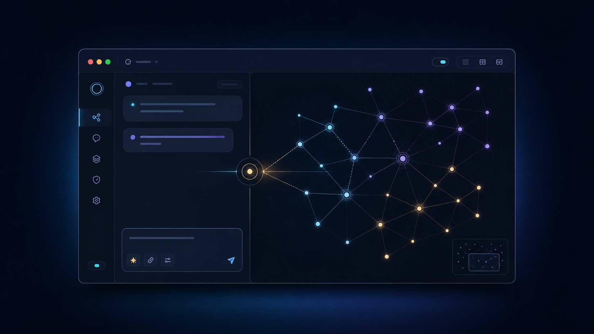

# Kairos

> A private-by-default desktop companion for asking questions across the notes
> you deliberately connect.


Kairos is a macOS app for working with a distributed personal knowledge system
without turning it into another cloud service or another wiki. Connect one or
more Obsidian folders, ask a question, and Kairos routes it to the appropriate
approved brain, retrieves a small cited context pack, and lets you choose how
to answer it.

Your notes remain in their original folders. Kairos owns the routing, consent,
provenance, and local application settings—not your knowledge base.

<p align="center">
  
</p>

<p align="center">
  <sub>Product concept — compact chat, explicit routing, and a privacy-aware whole-brain atlas.</sub>
</p>

> **Status — developer alpha.** Kairos starts with an empty local registry:
> each person chooses their own folders and policies. It is not yet a supported
> public download; see [Availability](#availability) before trying to install
> it.

## What it does

- **Summon chat with `⌥ Space`.** Open a focused compact chat, then expand the
  same conversation into the unified chat–Kairos–brain cockpit. What Next,
  history, brain access, and Settings open as focused cockpit panels.
- **Navigate the atlas directly.** Pan, zoom, use the minimap, focus a node,
  inspect safe metadata, and reveal file-backed nodes in Finder.
- **Route before reading.** Questions are routed to registered brains; unclear
  requests ask for a choice rather than broadcasting across every folder.
- **Keep context bounded and cited.** Kairos retrieves approved, relevant note
  excerpts and shows the routed brain(s) and source citations with a reply.
- **Run local AI through Ollama.** It detects Ollama, guides setup, downloads
  selected models in the app, and tests them at a 32K context window.
- **Use other providers deliberately.** OpenAI, Anthropic, Codex CLI, and
  Claude Code CLI remain modular options. Every non-local turn requires a
  one-time preview before anything leaves the Mac.
- **See a whole-brain atlas.** The metadata-only map shows brain clusters,
  explicit Markdown links, tags, and cross-brain bridges—without copying note
  bodies into the graph.
- **Keep writing intentional.** Kairos can prepare Markdown create/edit
  proposals only in an approved brain scope. You see the target path and diff
  and explicitly confirm the change. It cannot delete, move, or run arbitrary
  shell commands.

## Privacy and safety model

Kairos is designed around a simple boundary: **the user decides what is
connected, retrieved, sent, and written.**

| Boundary | Kairos behaviour |
| --- | --- |
| Connected notes | Indexed in place; Kairos does not copy or take ownership of vault notes. |
| Private material | `90_Private`, `#private`, and `agent_access: explicit_only` are withheld by default. |
| Local inference | Ollama is loopback-only at `http://localhost:11434`. |
| Cloud/API/CLI turns | A per-turn preview shows the destination, selected content, temporary attachments, and model. No silent provider/model fallback. |
| Uploads | Up to five temporary `.md`, `.txt`, `.pdf`, or `.docx` files (20 MB each); extracted text is discarded after the turn. |
| Writes | Markdown create/edit only, inside registered allowed directories, using a bounded diff and short-lived confirmation nonce. |
| Scoped execution | A time-limited session grant can be bound to one provider and one brain. It is never a grant to the Mac, shell, deletes, moves, private notes, or unreviewed egress. |

## Local model setup

Kairos uses [Ollama](https://ollama.com/) for local models. The app can open the
official Ollama installer when it is missing; after Ollama is running, models
are downloaded through Ollama from within Kairos.

- The model selector is explicit—Kairos never silently changes model or lowers
  the configured context window.
- Recommendations are hardware-aware. Apple Silicon uses unified memory;
  NVIDIA planning uses VRAM rather than extra system RAM.
- The memory budget is a recommendation cap, not a claim about the machine’s
  installed memory.
- The default target is one **32K-context** conversation with conservative
  headroom. Potentially runnable but tight models stay in the advanced catalog
  until a real 32K test verifies them.

## Availability

### For general users

**Not yet.** There is currently no public GitHub Release, signed/notarized
DMG, or Homebrew cask. A future public release will have a download link here
and release notes with a verified checksum.

### For developers and maintainers

The repository can be built on macOS for development. It requires a current
Rust toolchain, Node.js with pnpm, and the usual macOS/Xcode command-line build
tools for Tauri.

```bash
git clone https://github.com/tuntharm/kairos.git
cd kairos
pnpm install
pnpm desktop:dev
```

To create a production app bundle locally:

```bash
pnpm desktop:build
# Output: target/release/bundle/macos/Kairos.app
```

The app starts with no connected brain. Use **Settings → Add brain** to choose
an existing Obsidian folder and review its local retrieval, graph, egress, and
write policies before Kairos can read anything.

## Release and Homebrew roadmap

`brew install --cask kairos` is a **distribution step**, not the first public
release step. Before adding a cask, Kairos needs:

1. A generic, zero-personal-data first-run experience.
2. A public versioned GitHub Release with an app/DMG asset and SHA-256 checksum.
3. Developer ID signing and Apple notarization for every release build.
4. A published licence/EULA and privacy terms that match the intended business
   model.
5. A Homebrew cask in either `homebrew/cask` or a maintained
   `tuntharm/homebrew-tap` that points to the immutable release asset.

Until then, publishing a `brew` command would create an installation path that
looks official but cannot yet give users a safe, maintainable release.

## Architecture

```text
Tauri desktop app
  ├─ policy-first kairos-core
  │    ├─ brain routing and bounded retrieval
  │    ├─ access, egress, and write policies
  │    ├─ local-model recommendations and Ollama integration
  │    └─ graph metadata and citations
  ├─ local chat history and native macOS integrations
  ├─ optional provider adapters
  │    ├─ Ollama
  │    ├─ OpenAI API / Anthropic API
  │    └─ installed Codex CLI / Claude Code CLI
  ├─ kairos-cli
  └─ kairos-mcp (route-only, no note bodies)
```

| Path | Purpose |
| --- | --- |
| `apps/desktop/` | macOS Tauri desktop app and React interface |
| `crates/kairos-core/` | Routing, policy, context, models, providers, graph, and write safeguards |
| `crates/kairos-cli/` | Command-line interface |
| `crates/kairos-mcp/` | Local route-only MCP server |
| `docs/` | Supporting documentation, including [MCP details](docs/mcp.md) |

## Development checks

```bash
cargo fmt --all --check
cargo test --workspace
pnpm --dir apps/desktop run build
pnpm desktop:build
```

## Contributing and licence

External contribution guidelines and a public licence have not yet been
published. The repository is currently marked `UNLICENSED`; visibility of the
source is not permission to redistribute it or ship derivative builds. If you
would like to work with Kairos, please open an issue once the repository is
public, or contact the maintainer through the repository profile.

## Principles

1. **Route before reading.** Context is intentional, not automatic scraping.
2. **Local by default.** External providers are optional and consented.
3. **Notes stay authoritative.** Kairos augments existing systems; it does not
   replace them.
4. **No invisible actions.** Every write and external handoff is explicit.
5. **Useful now.** The goal is to surface the right context and next action at
   the right moment.
